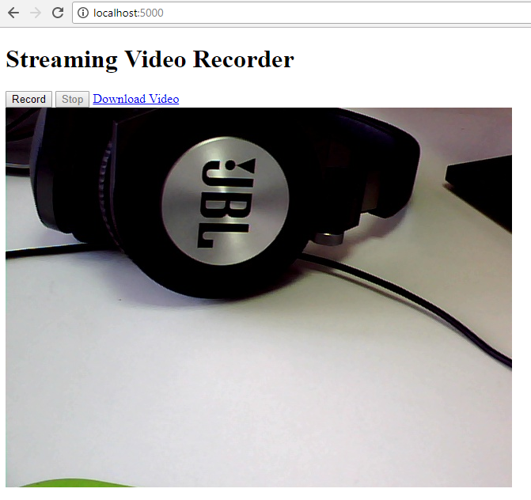

ANFCHAN

I have modified the codebase of the blogpost readme left here for documentation. I have added time based nomenclature to the saved video files on RasPi as opposed to a single file name, and disabled the multithreading present as to get a better insight on the code documentation and operation. I may add the multithreading back as needed but at the moment it is disabled.

The other problem I found with the code is that it suffers from browser caching issues, meaning that unless you are operating in incognito mode or similar private browsing, running the record function of the server will work for the first time, then proceed to cache the first recorded video and make all downloads of the first video. I have not found a proper solution to this problem. 

The video stream will stop after the recording/download is finished. Opening a new window with the same link will reset the video stream.


# Streaming Video Recorder
Use OpenCV-Python and Flask to create a web streaming video recorder for camera.

## Environment
* Python 2.7 or 3.5
* OpenCV 3.3.0

## How to Run 
1. Install **Flask**:

    ```
    pip install flask
    ```

2. Run the app:

    ```
    python server.py
    ```
    

## Reference
* https://github.com/log0/video_streaming_with_flask_example

## Blog
[How to Build Web Camera Recorder Using OpenCV and Flask][1]

[0]:https://en.wikipedia.org/wiki/Microsoft_Windows_SDK
[1]:http://www.codepool.biz/web-camera-recorder-oepncv-flask.html
